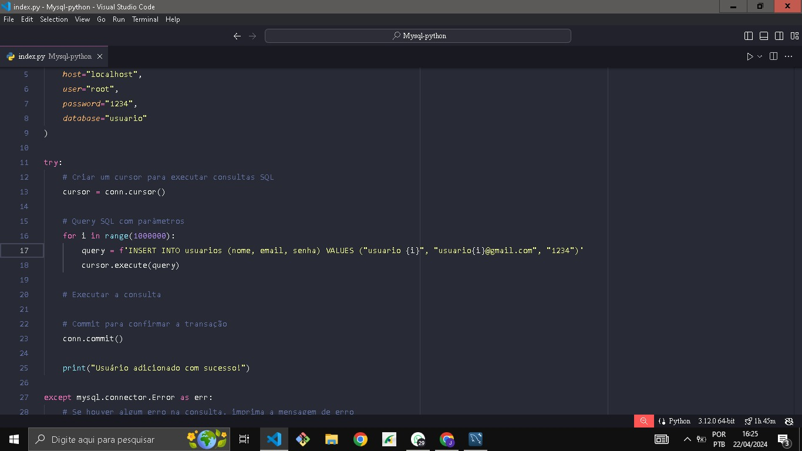

# Script para adcionar 1 milhão de usuários em uma tabela com python e mysql.

Esse script foi proposto em uma aula de banco de dados. Foi proposto criar um script em qualquer linguagem que adicionasse esse montante.

Escolhi o python pela facilidade e pela familiariedade que tenho com a linguagem.

## Fotos

## Tempo de execução do código

